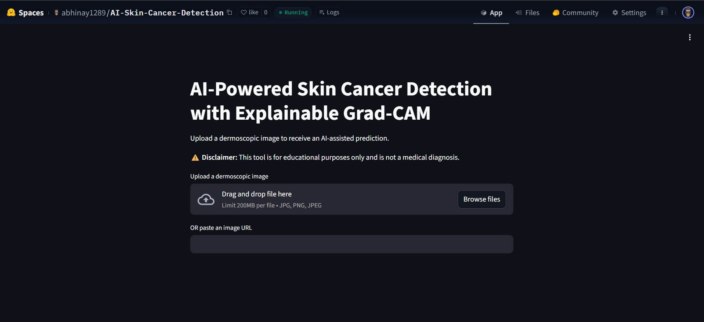
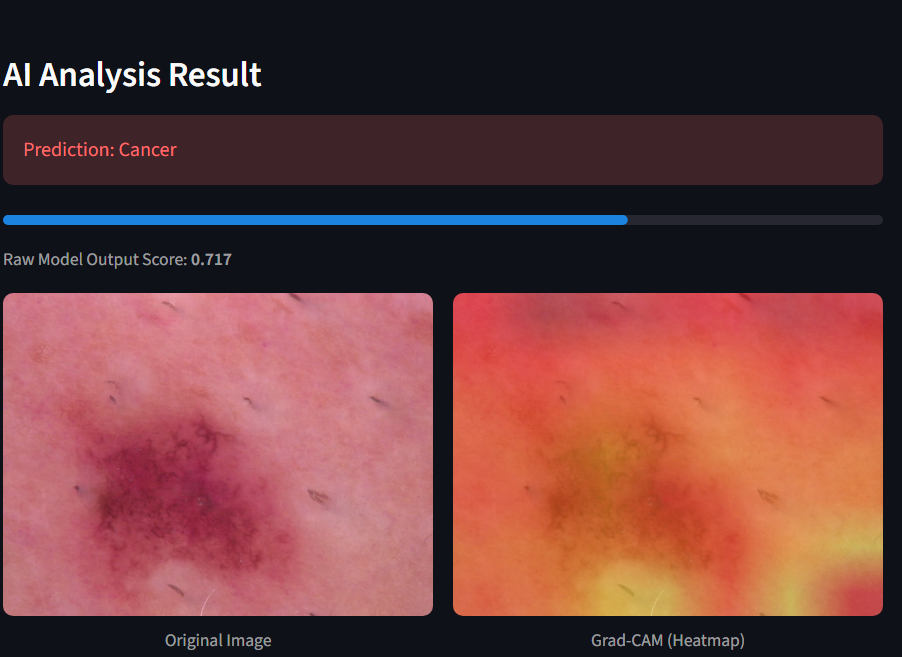

# 🔬 Skin Cancer Detection using EfficientNetB0 (Transfer Learning)

## Project Overview

Clinically-aware deep learning system designed for reliable skin cancer prediction with leakage prevention, threshold tuning, and Grad-CAM interpretability.

---
## Live Deployment
**Live Demo:** [https://huggingface.co/spaces/abhinay1289/AI-Skin-Cancer-Detection](https://huggingface.co/spaces/abhinay1289/AI-Skin-Cancer-Detection)\



The trained model was deployed using streamlit on Hugging Face Spaces, enabling real-time predictions through an interactive web application along with the saved keras model.

**Features:**
- **Local File Upload :** Upload images from local device for instant predictions
- **URL-Based Inference :** Provide image address for classification
- **Real-time results powered by saved `.keras` model

---
## Results

### **Test Metrics**

* **PR-AUC:** 0.717
* **ROC-AUC:** 0.819
* **Accuracy:** 0.76

---

### Classification Report

| Class             | Precision | Recall | F1-Score | Support |
| ----------------- | --------- | ------ | -------- | ------- |
| 0 (Non-Cancerous) | 0.81      | 0.80   | 0.81     | 678     |
| 1 (Cancerous)     | 0.66      | 0.68   | 0.67     | 390     |

---

### Confusion Matrix

```
[[543, 135],
 [124, 226]]
```
---
## Key Highlights

* Prevented patient-level data leakage
* Used PR-AUC as the primary metric for imbalanced data
* Implemented mixed precision training
* Applied staged fine-tuning
* Performed threshold optimization
* Added explainability with Grad-CAM

---
## Project Structure
```
├── Skin_Disease.ipynb              # Training Notebook
├── app.py                          # Streamlit UI
├── requirements.txt                # Requirements for this project
├── README.md
```
---

## Dataset

* **Source:** [https://www.kaggle.com/datasets/farjanakabirsamanta/skin-cancer-dataset](https://www.kaggle.com/datasets/farjanakabirsamanta/skin-cancer-dataset)
* Metadata from **HAM10000** merged with image directories by mapping filenames to their paths using a dictionary.

### Dataset Strategy

* Converted multi-class labels into binary:
  * **Cancerous → 1**
  * **Non-cancerous → 0**
* Used **StratifiedGroupKFold** grouped by `lesion_id` to prevent patient-level data leakage.

### Dataset Split

Total Images: 10,015
* **Train:** ~70%
* **Validation:** ~15%
* **Test:** ~15%

*(Grouped splitting ensures images from the same lesion never appear across multiple sets.)*

---

## Data Preprocessing

* Performed EDA on HAM10000 metadata.
* Visualized sample images across categories.
* Attached image paths to the dataframe for generator-based loading.

### Image Pipeline

* Used **ImageDataGenerator**
  * Applied augmentation **only on training data** *(rotation,zoom,flips)*
  * Integrated EfficientNet preprocessing
* Enabled **Mixed Precision Training** for faster GPU throughput.
* Computed **class weights** to address imbalance.

**Input Resolution:** 224×224
**Batch Size:** 16
---

## Model Architecture
* **Base Model:** EfficientNetB0 (ImageNet pre-trained)
* Initially frozen for feature extraction.

### Custom Head

* GlobalAveragePooling2D()
* BatchNormalization()
* Dense (256, ReLU)
* Dropout(0.4)
* Dense(1, Sigmoid)

### Regularization

* Early Stopping (monitor: `val_pr_auc`)
* Class Weights
* Two-stage transfer learning

---

## Training

### Phase 1 — Feature Extraction

* Frozen backbone
* Learning Rate: **1e-4**
* Epochs: **7**
* Metrics: PR-AUC, ROC-AUC

### Phase 2 — Fine-Tuning

* Unfroze last **80 layers**
* Learning Rate: **2e-5**
* Early stopping enabled
* Class weights used
* Epochs: 10

### Threshold Optimization

Instead of using the default 0.5 threshold, tuning was performed on test probabilities.

**Selected Threshold: 0.61**
→ Prioritizes diagnostic reliability while maintaining balanced precision-recall.

---

## Model Interpretability — Grad-CAM

* Extracted the top convolutional layer from EfficientNetB0.
* Built a gradient model to generate heatmaps.
* Superimposed activation maps onto original images.

The model consistently focused on lesion regions rather than background artifacts, helping clinicians visually verify that predictions are based on medically relevant regions rather than background artifacts.


---
## Tech Stack
* Deep Learning: TensorFlow / Keras, EfficientNetB0
* ML Tools: Scikit-learn, Pandas, NumPy
* Visualization: Matplotlib, Seaborn
* Deployment: Streamlit, Hugging Face Spaces
* Optimization: Mixed Precision Training
* Explainability: Grad-CAM

---
## Run Locally

Download `skin_cancer_detector.keras` model file from the huggingface space to the project directory

`git clone https://github.com/abhinay12890/Skin_Cancer_Detection_using_EfficientNetB0`\
`cd repository_name`\
`streamlit run app.py`

---

## Author

**Kalavakuri Abhinay**
